# Fastfood-website-Footbridge-fish-chips

[LIVE DEMO](https://yuntianhe2abc.github.io/Fastfood_website_fish_and_chips/)

This project is a demonstration website for a small business - Footbridge Fish & Chips. It includes home, menu, testimonials, about us and find us pages. Through this project, my knowledge of HTML, CSS, SASS, and JS was consolidated. And I also learned a lot about **file and folder structure, SASS features, responsive design, and debugging on mobile devices.**

 - The layout and color scheme are designed according to their logo and menu.

 - **The responsive design has been made for PC, ipad, and mobile phones.**

 - PC end has some beautiful user interactions

 - Tech stack: HTML, SASS, and Javascript

 - Currently, it contains static pages. No database involved. In the future, reservation and order system will be added hopefully.

## For PCs

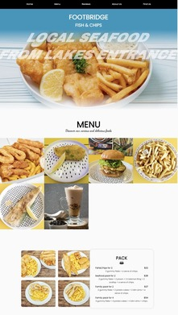 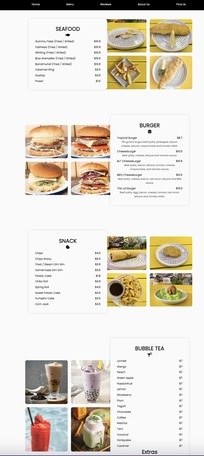 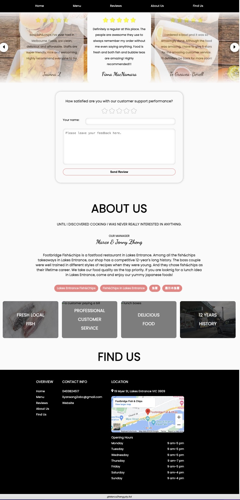

## For Mobile Phone

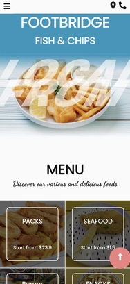  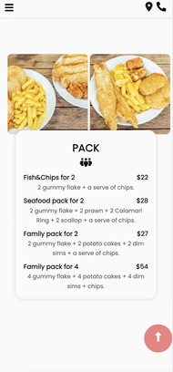 
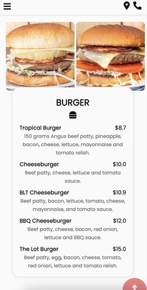 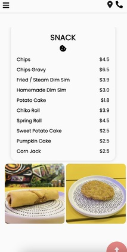 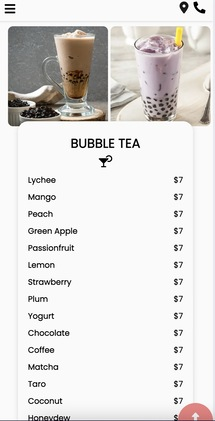
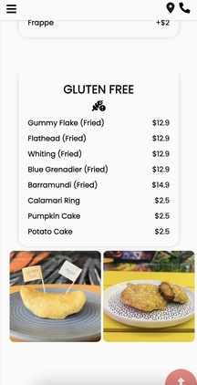 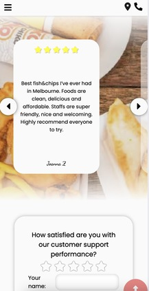 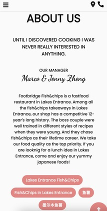 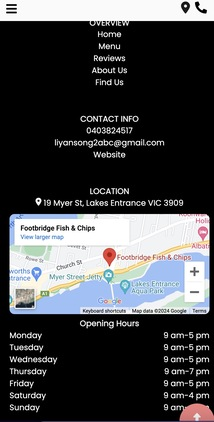

## For Pads
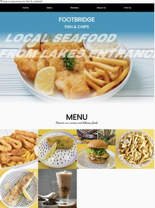 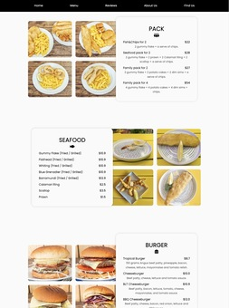 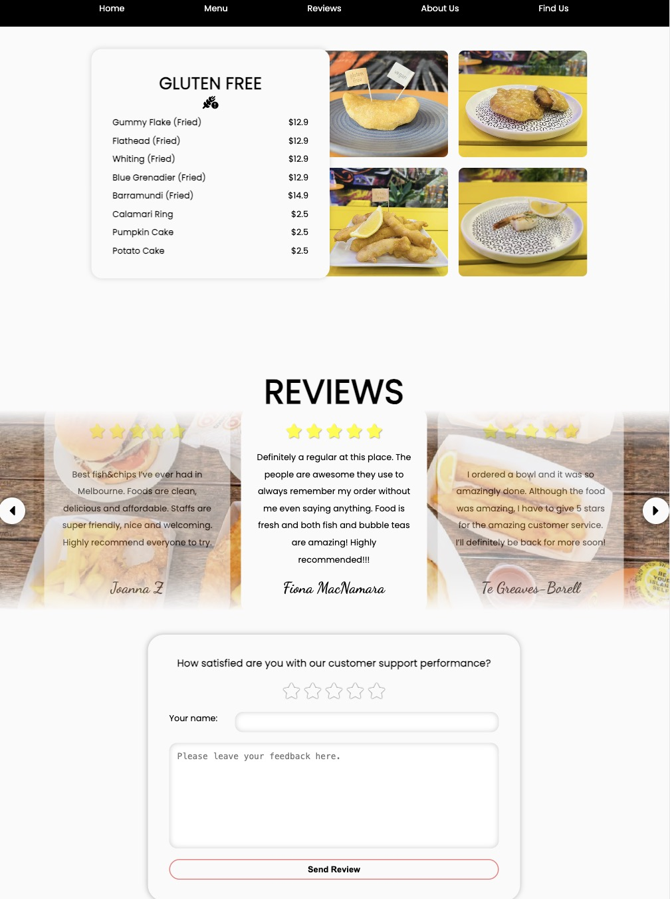 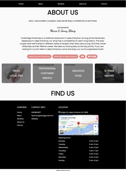

